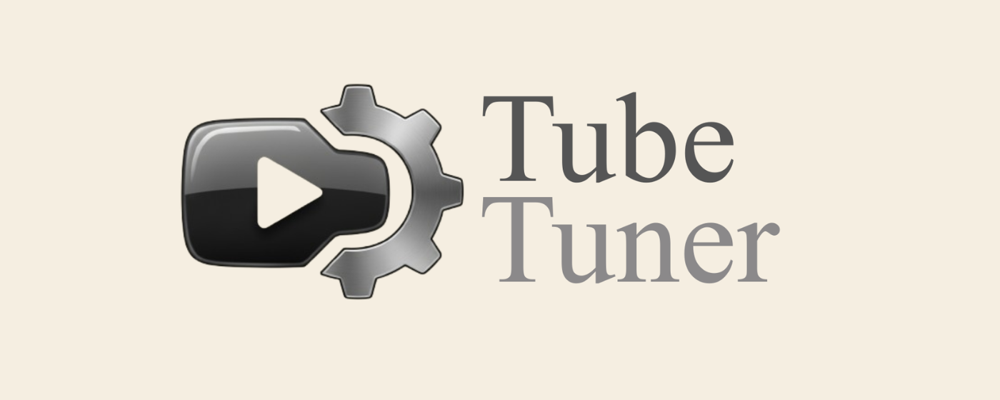

<a id="readme-top"></a>

[![Contributors][contributors-shield]][contributors-url]
[![Forks][forks-shield]][forks-url]
[![Stargazers][stars-shield]][stars-url]
[![Issues][issues-shield]][issues-url]
[![GNU GPL v3][license-shield]][license-url]

<h1 align="center">
  <br/>
  TubeTuner
</h1>

<h4 align="center">
  <a href="README.md">English</a> |
  <a href="README_VI.md">Tiếng Việt</a>
</h4>

<h3 align="center">Customize the YouTube interface to eliminate distractions and create a focused, personalized viewing experience</h3>

<p align="center">
  <a href="https://github.com/PhanKydeptrai/TubeTuner"><strong>Explore the docs »</strong></a>
  <br /><br />
  <a href="https://github.com/PhanKydeptrai/TubeTuner">View Demo</a>
  ·
  <a href="https://github.com/PhanKydeptrai/TubeTuner/issues/new?labels=bug&template=bug-report---.md">Report Bug</a>
  ·
  <a href="https://github.com/PhanKydeptrai/TubeTuner/issues/new?labels=enhancement&template=feature-request---.md">Request Feature</a>
</p>

---

## Table of Contents

1. [Get This Extension](#get-this-extension)
2. [About The Project](#about-the-project)
   - [Built With](#built-with)
3. [Getting Started](#getting-started)
   - [Installation](#installation)
4. [Usage](#usage)
5. [Contributing](#contributing)
6. [License](#license)
7. [Contact](#contact)

---

## Get This Extension

[](https://chromewebstore.google.com/detail/tubetuner/ekllndjjhcpljlfhfblfcagbdjnjkbco)
[](https://addons.mozilla.org/vi/firefox/addon/tubetuner/)

<p align="right">(<a href="#readme-top">back to top</a>)</p>

---

## About The Project

TubeTuner is a Chrome/Firefox extension that lets you customize your YouTube interface to match your preferences. Hide distracting elements and focus on video content with 21 different hide/show options, plus utility features like presets and export/import for backups.

### What's New in v1.3.9
- **Hide Thumbnails Feature** — Added a new option to hide thumbnails across YouTube surfaces.
- **Hide Channel Improvements** — Improved hiding for the channel block below videos, including channel name, avatar, and subscribe controls.
- **Preset Improvements** — Improved custom preset management with support for updating saved presets, renaming them, and keeping older presets compatible with newly added settings.


### Features

**Content & Feed Controls**
- Hide Home Feed — Avoid distractions from the YouTube homepage
- Hide Video Sidebar — Hide the entire video sidebar (includes live chat, recommendations, and playlist)
  - Hide Live Chat — Control live chat visibility independently
  - Hide Video Suggestions — Control video recommendations visibility independently
  - Hide Playlist — Control playlist panel visibility independently
- Hide Comments — Hide the video comments section
- Hide Shorts — Completely hide Shorts videos and the Shorts section
- Hide Thumbnails — Hide thumbnails across video lists and recommendation surfaces
- Hide Channel — Hide the channel block below the video, including the channel name, avatar, and subscribe controls
- Hide Shop — Hide the YouTube Shop section

**Interface Elements**
- Hide Top Header — Hide the top navigation bar
- Hide Notifications Bell — Hide the notification bell icon
- Hide Explore & Trending — Hide Explore and Trending tabs from the sidebar
- Hide More from YouTube — Hide the "More from YouTube" section
- Hide Buttons Bar — Hide the action buttons bar below the video
- Grayscale — Apply a grayscale filter to the entire YouTube UI

**Video Controls**
- Hide Video Controls — Hide the video player controls (includes progress bar and duration)
  - Hide Progress Bar — Remove the progress bar when watching videos
  - Hide Duration — Hide current time and total duration information
- Hide End Screen Cards — Hide end screen cards that appear at the end of videos
- Hide Description — Hide the video description section
- Hide AI Summary — Hide the AI-generated summary on video pages

**Other Features**
- Export/Import Settings — Export settings to a file for backups and import to restore or share configurations
- Presets — Apply built-in presets (None, Balanced, Focus), create or update custom presets, rename them, and export/import them for backup
- Dark Mode — Automatically follows your system theme
- Multi-language — Supports Vietnamese and English
- Enable/Disable Extension — Quickly toggle the extension on or off from the popup

<p align="right">(<a href="#readme-top">back to top</a>)</p>

### Built With

- [![JavaScript][JavaScript-shield]][JavaScript-url]
- [![HTML5][HTML5-shield]][HTML5-url]
- [![CSS3][CSS3-shield]][CSS3-url]

<p align="right">(<a href="#readme-top">back to top</a>)</p>

---

## Getting Started

Follow these steps to set up a local copy of the extension.

### Installation

1. **Clone the repository:**
   ```sh
   git clone https://github.com/PhanKydeptrai/TubeTuner.git
   ```

2. **Install dependencies:**
   ```sh
   npm install
   ```

3. **Set up environment variables:**
   Copy the example environment file and update the values if necessary:
   ```sh
   cp .env.example .env
   ```

4. **Build the extension:**

   For Chrome:
   ```sh
   npm run build:chrome
   ```

   For Firefox:
   ```sh
   npm run build:firefox
   ```

5. **Load in Chrome:**
   - Open `chrome://extensions/`
   - Enable **Developer mode** (top right)
   - Click **Load unpacked**
   - Select the `dist/chrome` folder

6. **Load in Firefox:**
   - Open `about:debugging#/runtime/this-firefox`
   - Click **Load Temporary Add-on...**
   - Select any file in the `dist/firefox` folder (e.g., `manifest.json`)

<p align="right">(<a href="#readme-top">back to top</a>)</p>

---

## Usage

1. **Open YouTube** and play any video.
2. **Click the extension icon** in the browser toolbar.
3. **Explore the 3 main sections:**
   - **Content & Feed Controls** — Hide/show Home Feed, Video Sidebar (with grouped controls for Live Chat, Video Suggestions, Playlist), Comments, Shorts, Thumbnails, Channel, Shop
   - **Interface Elements** — Hide/show Top Header, Notifications Bell, Explore & Trending, More from YouTube, Buttons Bar, Grayscale
   - **Video Controls** — Hide/show Video Controls (with grouped controls for Progress Bar, Duration), End Screen Cards, Description, AI Summary
4. **Use toggle switches** to enable or disable each feature individually.
5. **Switch theme** — Click the sun/moon button at the top to toggle Light/Dark mode.
6. **Export/Import Settings** — Use the buttons in the settings section to backup or restore configurations.
7. **Presets** — Choose a built-in preset (None, Balanced, Focus) to apply multiple settings at once.
8. **Custom Presets** — Configure your toggles and click "Save preset" to create a named preset. You can update an existing custom preset after changing settings, rename it, import presets from a `.json` file, export them for backup, or delete a selected custom preset.

<p align="right">(<a href="#readme-top">back to top</a>)</p>

---

## Contributing

Contributions are what make the open source community such an amazing place to learn, inspire, and create. Any contributions you make are **greatly appreciated**.

If you have a suggestion, please fork the repository and create a pull request. You can also open an issue with the tag `enhancement`. Don't forget to give the project a star!

1. Fork the project
2. Create your feature branch: `git checkout -b feature/AmazingFeature`
3. Commit your changes: `git commit -m 'Add some AmazingFeature'`
4. Push to the branch: `git push origin feature/AmazingFeature`
5. Open a Pull Request

<p align="right">(<a href="#readme-top">back to top</a>)</p>

---

## License

Distributed under the MIT License. See `LICENSE` for more information.

<p align="right">(<a href="#readme-top">back to top</a>)</p>

---

## Contact

Phan Ky — phanky.dev@proton.me

Project Link: [https://github.com/PhanKydeptrai/TubeTuner](https://github.com/PhanKydeptrai/TubeTuner)

<p align="right">(<a href="#readme-top">back to top</a>)</p>

---

<!-- MARKDOWN LINKS & IMAGES -->
[contributors-shield]: https://img.shields.io/github/contributors/PhanKydeptrai/TubeTuner.svg?style=for-the-badge
[contributors-url]: https://github.com/PhanKydeptrai/TubeTuner/graphs/contributors
[forks-shield]: https://img.shields.io/github/forks/PhanKydeptrai/TubeTuner.svg?style=for-the-badge
[forks-url]: https://github.com/PhanKydeptrai/TubeTuner/network/members
[stars-shield]: https://img.shields.io/github/stars/PhanKydeptrai/TubeTuner.svg?style=for-the-badge
[stars-url]: https://github.com/PhanKydeptrai/TubeTuner/stargazers
[issues-shield]: https://img.shields.io/github/issues/PhanKydeptrai/TubeTuner.svg?style=for-the-badge
[issues-url]: https://github.com/PhanKydeptrai/TubeTuner/issues
[license-shield]: https://img.shields.io/github/license/PhanKydeptrai/TubeTuner.svg?style=for-the-badge
[license-url]: https://github.com/PhanKydeptrai/TubeTuner/blob/main/LICENSE
[JavaScript-shield]: https://img.shields.io/badge/JavaScript-F7DF1E?style=for-the-badge&logo=javascript&logoColor=black
[JavaScript-url]: https://developer.mozilla.org/en-US/docs/Web/JavaScript
[HTML5-shield]: https://img.shields.io/badge/HTML5-E34F26?style=for-the-badge&logo=html5&logoColor=white
[HTML5-url]: https://developer.mozilla.org/en-US/docs/Web/Guide/HTML/HTML5
[CSS3-shield]: https://img.shields.io/badge/CSS3-1572B6?style=for-the-badge&logo=css3&logoColor=white
[CSS3-url]: https://developer.mozilla.org/en-US/docs/Web/CSS
